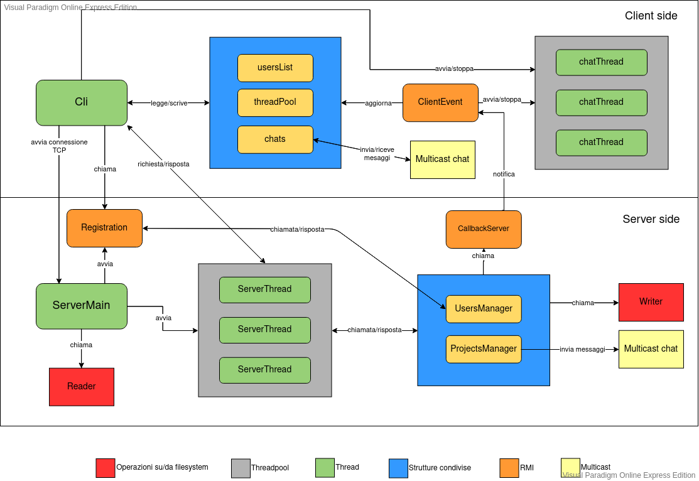

Scelte progettuali
==================

Componenti
----------

### Lato server

Le componenti base del sistema sono:

-   **Card** rappresenta una card

-   **Project** rappresenta un progetto, contiene le card e i membri
    relativi al progetto

-   **User** reppresenta un utente

Definite tutte nel package *com.worth.components* e utilizzate dalle
strutture condivise:

-   **ProjectsManager** mantiene la lista di tutti i progetti, permette
    l'aggiunta, la modifica e la cancellazione di quest'ultimi.\
    Utilizza le funzioni di rmi callback definite nell'iterfaccia
    **CallbackServer** per notificare agli utenti:

    -   I nuovi progetti dei quali sono membri

    -   I progetti eliminati e dei quali erano membri

-   **UsersManager** mantiene la lista degli utenti, permette la
    registrazione il login e il logout di quest'ultimi.\
    Utilizza, come sopra, le funzioni di rmi callback per notificare
    agli utenti il cambio dello stato di un utente (online/offline).\
    Sia **UsersManager** che **ProjectsManager** utilizzano i metodi
    statici della classe **Writer** per rendere persistente lo stato del
    sistema.

### Lato client

Le componenti principali lato client sono 2:

-   **Cli** definita in *com.worth*, avvia la connessione TCP e gestisce
    la comunicazione con il server.\
    Mantiene le strutture dati modificate dalle funzioni di rmi callback
    implementate in **ClientEvent** e chiamate dal server.

-   **Chat** definita in *com.worth.chat* è un thread avviato per ogni
    progetto dell'utente e contiene i metodi per leggere e scrivere
    da/sulla chat.

Persistenza
-----------

La persistenza dello stato del sistema è garantita e viene attuata
attraverso le calssi **Reader** e **Writer** definite dento il package
*com.worth.io*, entrambe composte da soli metodi statici.\
Per permettere una consistenza e persistenza delle informazioni anche in
casi eccezionali di guasti del server è stato deciso di scrivere sul
filesystem dopo ogni modifica o aggiunta di un informazione in memoria.

### Struttura database

Lo stato del sistema viene salvato all'interno della directory *db*
creata all'avvio del server nel caso fosse inesistente.\
Ogni progetto viene rappresentato con una directory scritta all'interno
della directory *db/projects*.\
Gli attributi *chatIp* e *members* di ogni progetto vengono salvati in 2
file distinti all'interno della directory *nomeprogetto/.meta* nominati
rispettivamente *ip* e *members*.\
Le cards vengono invece salvate all'interno della directory
*nomeprogetto* creando un file per ogni card.\
Gli utenti vengono salvati all'interno della directory *db/users*
creando come per le cards un file per ogni utente.\
Il salvataggio di dati non primitivi come array o in generale oggetti di
del sistema viene fatto serializzando l'oggetto in un formato json e poi
salvando la stringa json in un file, in particolare questo avviene per
gli utenti, i membri di ogni progetto e le cards.

Sicurezza
---------

È stato deciso di non mantenere le password in chiaro ne in memoria ne
sul dico ma bensì al momento della registrazione viene calcolato e
salvato l'hash della password inviata dal client.\
In questa maniera si garantisce lato server un minimo livello di
sicurezza nel caso in cui ci fossero delle intrusioni e/o in casi di
information disclosure.

Chat
----

La chat è gestita interamente lato client con l'utilizzo dei metodi di
callback implementati nella classe **ClientEvent** contenuta nel package
*com.worth.rmi.callback* e della classe **Chat** contenuta in
*com.worth.chat*.\

### Comunicazione ip delle chat

È stato scelto di usare i meccanismi di java RMI e java RMI Callback
oltre che per la registrazione e per notificare ai vari clients connessi
la lista degli utenti, anche per comunicare l'indirizzo ip di multicast
per le chat di nuovi progetti o progetti a cui un utente è stato
inserito come membro.\
In particolare l'interfaccia condivisa tra client e server
**ClientEventInterface** definita nel package *com.worth.rmi.callback*
contiene i metodi:

-   notifyProjectIp(String projectName, String ip)

-   notifyDeletedProject(String projectName)

Il primo serve per notificare agli utenti membri di un nuovo progetto
l'ip di quest'ultimo, il secondo per notificare invece sempre agli
stessi la cancellazione di un progetto del quale erano membri, questo
per permettere di eliminare lato client le risorse allocate per leggere
la chat di quel progetto.\
L'unico momento in cui il client viene a conoscenza degli ip dei vari
progetti senza il meccanismo di callback è al login dove, se
l'operazione è avvenuta con successo, vengono inviati insieme alla lista
degli utenti come risposta sulla connessione TCP avviata dal client.\
La scelta di utilizzare questo metodo è motivata dal fatto che la
notifica di aggiunta e/o di cancellazione dei progetti è quasi
istantanea e permette al client di essere sempre aggiornato su azioni di
altri su progetti di cui è membro.\
In più evita all'utente di avviare esplicitamente la lettura di nuovi
messaggi dalle chat dei progetti di cui è membro infatti tutto questo
viene fatto automaticamente al momento del login e per tutto il tempo
che l'utente è loggato nell'implementazione lato client dell'interfaccia
**ClientEventInterface**.

### Lato client

**Chat** viene utilizzata per avviare un thread che in background legge
e salva i messaggi che arrivano per un determinato progetto, contiene in
oltre 2 metodi: uno per leggere i messaggi arrivati dopo l'ultima
lettura e uno per inviare un messaggio in chat.\
Il metodo di callback *notifyProjectIp* crea un instanza Chat per ogni
nuovo progetto e avvia il thread che legge i messaggi per quel progetto,
il metodo *notifyDeletedProject* invece termina il thread avviato per un
progetto eliminato e quindi stoppa il salvataggio di nuovi messaggi.

#### Eliminazione di un progetto

È stato scelto di permettere agli utenti di leggere la chat di un
progetto anche dopo la sua eliminazione.\
In particolare quando un progetto viene eliminato l'operazione viene
eseguita e notificata attraverso le callback ai vari utenti membri del
progetto, e quindi lato client le risorse allocate per leggere la chat
vengono eliminate. Quello che non viene eliminato è l'oggetto contenente
i messaggi non letti, almeno fino al momento in cui l'utente non crea o
non viene aggiunto a un progetto con lo stesso nome di quello eliminato.

### Lato server

L'unica cosa che fa il server sulle chat dei vari progetti è inviare
messaggi di notifica ai membri di un progetto al quale è stata fatta una
modifica, come aggiunta di cards o membri, spostamento di cards e/o
rimozione del progetto stesso.

Schema dell'architettura
------------------------



Scelte implementative
=====================

Strutture dati
--------------

È stato scelto di rappresentare quasi tutte le liste con la struttura
dati **HashMap** o la versione concorrente **ConcurrentHashMap** per
rendere efficiente aggiunta, ricerca e rimozione di informazioni dato
che vengono eseguite con complessità pari a $\Theta(1)$.\

### Lato server

Per le 4 liste delle card, per la lista dei progetti e degli utenti è
stata usata un'**HashMap** con chiave rispettivamente il nome della
card, del progetto o dell'utente e come valore l'oggetto corrispondente.
Non c'è stato bisogno di una struttura concorrente perché ogni metodo di
**ProjectsManager** e **UsersManager** che gestiscono queste
informazioni prende la lock implicita sull'intero oggetto prima di
eseguire qualsiasi operazione.\
**ConcurrentHashMap** è stata usata invece per rappresentare gli utenti
interessati a ricevere notifiche con callback in **CallbackServer** dato
che i metodi *registerForEvents* e *unregisterForEvents* non fanno altro
che eseguire rispettivamente una *put* e una *remove*.\
Per la lista dei membri di un progetto e per la history di ogni card è
stato utilizzato invece un'**ArrayList**, infatti per la prima l'unica
cosa da memorizzare sono gli username dei membri e per la seconda solo
gli stati delle card.

### Lato client

È stata usata un'**HashMap** con sincronizzazione esplicita per la lista
degli oggetti **Chat** e una **ConcurrentHashMap** per la lista degli
utenti in quanto vengono accedute contemporaneamente da **Cli** e dai
metodi di callback.\
Per la prima viene usato come chiave il nome del progetto e come valore
l'oggetto **Chat** corrispondente, per la seconda come chiave viene
usato il nome dell'utente e come valore un booleano dove true equivale a
utente online false il contrario.

Porte utilizzate
----------------

Per il corretto funzionamento di tutto il servizio sono state utilizzate
3 porte:

-   6660 la porta alla quale si connettono i clients per instaurare la
    connessione TCP con il server

-   6661 la porta usata per il registro rmi

-   6662 la porta usata per le chat in multicast

Modalità di gestione dei client
-------------------------------

È stato scelto di implementare la gestione delle connessioni e delle
richieste dei vari client con un multithreaded server piuttosto che un
server con selector. Questo perché si è preferito mantiene una
scalabilità elevata, ritardi di reply e accept generalmente bassi e una
semplicità nell'implementazione andando a perdere nell'efficienza
nell'I/O non utilizzando java NIO.

Gestione dei thread
-------------------

Lato server vengono avviati tanti threads quanti sono i client che si
collegano, lato client vengono avviati tanti threads quanti sono i
progetti dei quali quel determinato utente è membro. In entrambi i casi
viene utilizzata una threadpool in particolare viene creata una chached
threadpool dato che il numero di clients per il server e di progetti per
i clients è variabile.

Thread safeness
---------------

È stato deciso di utilizzare il meccanismo dei monitor e alcune
strutture concorrenti ove possibile per garantire semplicità nel codice
e soprattutto perché non è stato possibile utilizzare lock esplicite e
quindi sincronizzare i thread con una granularità più fine.

### Lato server

Utilizzando un multithreaded server, per garantire una consistenza delle
informazioni create, modificate e rimosse dai client, è stato necessario
rendere l'accesso agli utenti e ai progetti, quindi anche alle card e ai
membri dei quest'ultimi mutualmente esclusivo.\
Le classi che gestiscono queste informazioni sono **UsersManager** e
**ProjectsManager** e tutti i metodi di entrambe sono *synchronized*
dato che vanno a modificare lo stato che per la prima è la lista degli
utenti e per la seconda è la lista dei progetti.\
Non è stato possibile garantire una mutua esclusione a grana più fine,
utilizzando per esempio strutture concorrenti come
**ConcurrentHashMap**, dato che tutti i metodi fanno diversi controlli
prima di eseguire l'operazione richiesta e dal momento in cui la
chiamata di due o più metodi thread-safe di una stessa struttura non
garantisce più la thread-safeness della stessa è stato scelto di
utilizzare strutture non concorrenti e renderle thread-safe
esplicitamente.

### Lato client

Le uniche strutture condivise sono *usersList* che mantiene le coppie
$<nome utente, stato>$, *chats* che mantiene le coppie
$<nome progetto, chat>$ e *threadPool* che mantiene tutti i thread che
leggono le chat dei vari progetti dell'utente.\
Per le prime due è necessaria una sincronizzazione dato che vengono
accedute contemporaneamente da **Cli** e dai metodi di **ClientEvent** e
per l'ultima no dato che viene modificata solo dai metodi di callback,
**Cli** la modifica solo dopo o prima che il client si è rispettivamente
disiscritto o iscritto per le callback dal server.\
Per la prima è stato possibile usare la **ConcurrentHashMap**, infatti
*usersList* è utilizzato in **ClientEvent** dal metodo *notifyUserEvent*
che chiama solamente una *put* e in **Cli** dai metodi *listUsers* e
*listOnlineUsers* che generano un iteratore che ha un comportamento
fail-safe.\
Per la seconda invece non è stato possibile utilizzare una
**ConcurrentHashMap** perché il metodo *readChat* in **Cli** necessita
di una sincronizzazione esplicita, infatti anche con una struttura
concorrente ci potrebbe essere una race condition tra il controllo della
cancellazione del progetto e la rimozione della entry dalla mappa,
perciò si è preferito usare una **HashMap**.\

Generazione degli ip di multicast per le chat
---------------------------------------------

Per permettere la riusabilità degli ip dei progetti eliminati viene
utilizzato l'**ArrayList** *usedIPs* definito dentro **ProjectsManager**
che salva gli ip in uso. La generazione di un ip per ogni nuovo progetto
viene fatta dal metodo *generateIP* sempre definito in
**ProjectsManager** che genera un ip di multicast random controlla che
non si trovi dentro *usedIPs* e se questa condizione è verificata
ritorna l'ip generato altrimenti reitera fino a quando non genera un ip
non in uso. Quando un progetto viene cancellato si elimina anche da
*usedIPs* l'ip corrispondente a quel progetto permettendo il riuso.

Metodi della specifica
----------------------

I metodi:

-   *createProject*

-   *cancelProject*

-   *addCard*

-   *showCard*

-   *showCards*

-   *moveCard*

-   *getCardHistory*

-   *addMember*

-   *showMembers*

-   *listProjects*

sono stati implementati lato server dentro la classe
**ProjectsManager**.\
I metodi:

-   *login*

-   *logout*

-   *register*

sono stati implementati lato server dentro la classe **UsersManager**.\
Infine i metodi:

-   *sendChatMsg*

-   *readChat*

-   *listUsers*

-   *listOnlineUsers*

sono stati implementati lato client dentro la classe **Cli**.

### Modifiche

È stata modificata la firma dei metodi:

-   *createProject*

-   *cancelProject*

-   *addCard*

-   *showCard*

-   *showCards*

-   *moveCard*

-   *getCardHistory*

-   *addMember*

-   *showMembers*

-   *sendChatMsg*

con l'aggiunta del parametro *user* che corrisponde all'utente che
richiede l'operazione, questo per controllare se effetivamente l'utente
ha i permessi per fare quella determinata operazione che sta richiedendo
e per sapere chi vuole inviare il messaggio nel caso dell'ultimo
metodo.\
È stato modificato ulteriormente il metodo *moveCard* eliminando il
parametro che corrisponde alla lista di partenza della card, dato che
non dava nessuna informazione in più non reperibile direttamente dal
server. Infatti la lista in cui la card si trova prima del movimento è
conosciuta dal server e ovviamente viene utilizzata, prima di eseguire
lo spostamento, per controllare se quest'ultimo è fattibile.

Formato dei messaggi
====================

Nei messaggi scambiati tra client e server viene usato il carattere %
per separare le varie informazioni, tutti i messaggi hanno il seguente
formato:

(request/response code)%parametro1%parametro2%parametro3\....

dove parametro1, parametro2, parametro3,\... sono informazioni che
dipendono dal tipo di richiesta o di risposta.

Messaggi di richiesta
---------------------

\|c\|c\|c\| Codice richiesta & Operazione & Parametri\
0 & login &

  ---------- ----------
   username   password
  ---------- ----------

\
1 & logout & username\
2 & list projects &\
3 & create project & progetto\
4 & add member &

  ---------- --------
   progetto   membro
  ---------- --------

\
5 & show members & progetto\
6 & show cards & progetto\
7 & show card &

  ---------- ------
   progetto   card
  ---------- ------

\
8 & add card &

  ---------- ------ -------------
   progetto   card   descrizione
  ---------- ------ -------------

\
9 & move card &

  ---------- ------ --------------
   progetto   card   destinazione
  ---------- ------ --------------

\
10 & get card history &

  ---------- ------
   progetto   card
  ---------- ------

\
11 & cancel project & progetto\

Messaggi di risposta
--------------------

Anche i messaggi di risposta iniziano con un codice che indica il
successo o una classe di errore, nel caso del successo quello che segue
il codice sono dei dati o una stringa che descrive l'avvenuto successo,
nel caso di errore quello che segue il codice è un stringa che descrive
l'errore.

   Codice risposta                                    Significato
  ----------------- -------------------------------------------------------------------------------
          0                                operazione eseguita con successo
          1                                       errori di sintassi
          2                               errori relativi agli utenti/membri
          3                                 errori relativi alle passwords
          4          errori relativi a operazioni dove è necessario prima o dopo un login o logout
          5                                   errori relativi ai progetti
          6                            errori di permessi per alcune operazioni
          7                                   errori relativi alle cards

Esecuzione
==========

Dipendenze
----------

Il progetto è stato scritto usando la versione 14 dello SDK di java e
maven.\
L'installazione di maven varia in base al sistema operativo, per farlo
correttamente si può seguire la guida del sito ufficiale andando su
<https://maven.apache.org/install.html>.

### Debian based

Se ci si trova su un sistema basato su debian, come ubuntu,
l'intallazione è più semplice, infatti basta aprire il terminale e
digitare:

``` {.bash language="bash"}
    sudo apt install maven
```

Run
---

Per compilare e avviare il server posizionarsi all'interno della
directory *worthserver* e digitare sul terminale:

        $ mvn compile
        $ mvn exec:java -Dexec.mainClass="com.worth.ServerMain"

Se il server viene avviato correttamente allora verrà stampata a schermo
la stringa

        [INFO]: Listening for incoming connections...

Una volta avviato il server per avviare un client aprire un nuovo
terminale, posizionarsi all'interno della directory *worthclient* e
digitare:

        $ mvn compile
        $ mvn exec:java -Dexec.mainClass="com.worth.WorthMain"

Dopo aver avviato il client si avrà di fronte il prompt di worth:

        worth$

dal quale sarà possibile chiamare tutti i comandi del sistema,
consultabili digitando il comando *help*.\
Si consiglia di non copiare e incollare dal documento ma di scrivere a
mano i comandi perché in base al lettore di pdf che si usa i caratteri
copiati potrebbero essere errati e dare quindi errori di compilazione
e/o di esecuzione.\

Esempio di interazione con il client
------------------------------------

        worth$ register test password123
        SUCCESS: User test successfully registered
        
        worth$ login test password123
        SUCCESS: Logged in successfully
        
        test@worth$ createp testproj
        SUCCESS: Project successfully created
        
        test@worth$ addc testproj testcard this is a description
        SUCCESS: Card successfully added
        
        test@worth$ showcs testproj
        testcard
        
        test@worth$ showc testproj testcard
        NAME: testcard
        DESC: this is a description
        LIST: TODO
        
        test@worth$ movec testproj testcard inprogress
        SUCCESS: Card successfully moved
        
        test@worth$ sendmsg testproj i'm going to finish testcard
        SUCCESS: Message sent correctly
        
        test@worth$ movec testproj testcard done
        SUCCESS: Card successfully moved
        
        test@worth$ readchat testproj
        [WORTH]: test added card testcard
        [WORTH]: test moved card testcard into INPROGRESS
        [test]: i'm going to finish testcard
        [WORTH]: test moved card testcard into DONE
        
        test@worth$ delp testproj
        INFO: Deleting project testproj...
        SUCCESS: project successfully deleted
        
        test@worth$ readchat testproj
        [WORTH]: test deleted project
        
        test@worth$ readchat testproj
        PROJECT ERROR: Project testproj doesn't exist
        
        test@worth$ logout
        SUCCESS: Logged out successfully
        
        worth$ quit
